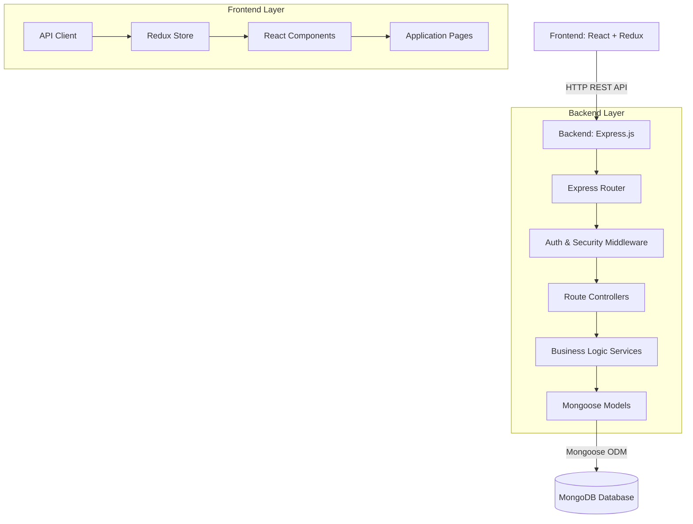

<h1 align="center">📦 OrderPulse - Amazon E-Commerce Analytics Dashboard</h1>

<div align="center">
  
  
  
  
  
  
  <br />
  
  
</div>

<br />

## 🔗 Important Links & Resources

Below are the core links related to this project, including live deployments, the API documentation, and the dataset used to populate the database:

- 🌐 **Live User Interface (Frontend):** [View Live on Vercel](https://amazon-orders-patel-manan-nileshbha.vercel.app/)
- ⚙️ **Live Backend API (Server):** [View Live on Render](https://amazon-orders.onrender.com/)
- 📘 **Postman API Documentation:** [View Postman Docs](https://documenter.getpostman.com/view/50840763/2sBXwntsU8)
- 📊 **Project Dataset (Google Drive):** [Download Dataset](https://drive.google.com/file/d/1U5BQP1mxjSau2Z2ni69n-LFw56lXldPf/view)

---

## 📖 Table of Contents
1. [Project Overview](#-project-overview)
2. [Core Features](#-core-features)
3. [Technology Stack](#-technology-stack)
4. [Architecture Diagrams](#-architecture-diagrams)
5. [Prerequisites](#-prerequisites)
6. [Installation & Setup](#-installation--setup)
7. [Environment Configuration](#-environment-configuration)
8. [Database Schema](#-database-schema)
9. [Redux State Management](#-redux-state-management)
10. [Comprehensive API Documentation](#-comprehensive-api-documentation)
11. [Project Structure](#-project-structure)
12. [Key Implementations](#-key-implementations)
13. [Deployment Guide](#-deployment-guide)
14. [Troubleshooting](#-troubleshooting)
15. [Contributing](#-contributing)
16. [License](#-license)

---

## 🚀 Project Overview

**OrderPulse** is a robust, full-stack enterprise e-commerce management and analytics platform. Designed to process and analyze massive amounts of order data, this dashboard empowers business owners, admins, and sellers with real-time insights, logistics tracking, and overarching control over their digital storefronts.

Handling thousands of records requires a highly optimized backend. The application leverages complex MongoDB aggregation pipelines to calculate revenue trends, average order values, and product performance dynamically. On the client side, the frontend provides a sleek, responsive, and highly interactive user experience powered by React, Tailwind CSS, and Recharts.

Whether you're tracking a package in transit, looking up a specific customer order, or analyzing the month's highest-grossing product category, OrderPulse centralizes all operational data into a single, beautiful interface.

---

## ✨ Core Features

### 🖥️ Frontend (Client) Features
* **Modern Dashboard Interface:** A highly polished, glassmorphic UI built with Tailwind CSS. Includes dynamic greeting cards, skeleton loaders, and smooth micro-animations.
* **Real-time Analytics:** Visual representation of data using `recharts`. Features Revenue Trend Area Charts, Sales by Category Pie Charts, and daily performance metrics.
* **Advanced Global Search:** A dedicated search interface with debounced inputs, instantly querying across order IDs, customer names, products, and brands without overloading the server.
* **Live Shipments Tracking:** A dedicated logistics module categorizing orders into "Pending Fulfillment", "In Transit", and "Delivered" states. Fetches live data based on current database status.
* **Trending Insights:** Uses intelligent backend aggregations to dynamically display the "Hottest Products" and "Top Performing Categories" across the entire lifetime of the business.
* **Secure Authentication Flow:** JWT-based login and registration system with persistent sessions, secure local storage, and role-based access control (RBAC).
* **Responsive Data Tables:** Paginated data tables handling thousands of rows efficiently, complete with custom status badges and integrated action modals.
* **Optimized State Management:** Centralized state handling with Redux Toolkit for seamless data flow between components without prop drilling.

### ⚙️ Backend (Server) Features
* **RESTful API Architecture:** Clean, modular routing with Express.js separating concerns into Controllers, Services, and Routes.
* **Advanced MongoDB Aggregations:** Utilizes MongoDB's `$match`, `$group`, `$sort`, and `$project` operators to perform heavy data crunching directly on the database layer.
* **Rate Limiting & Security:** Integrated `express-rate-limit` to prevent DDoS attacks and brute-force attempts. Uses `helmet` for secure HTTP headers.
* **Pagination & Sorting Engine:** Implements `mongoose-paginate-v2` to serve data in manageable chunks, drastically reducing payload sizes and load times.
* **Error Handling Middleware:** Global, centralized error handling wrapping all async routes to ensure consistent API responses and prevent server crashes.
* **Cross-Origin Resource Sharing (CORS):** Fully configured to allow seamless communication with the frontend application hosted on different domains.

---

## 🛠️ Technology Stack

### Frontend Stack
| Technology | Version | Purpose |
| :--- | :--- | :--- |
| **React** | `^19.x` | Core UI Library |
| **Vite** | `^6.x` | Next-generation build tool and dev server |
| **Redux Toolkit** | `^2.12.x` | Predictable state management container |
| **Tailwind CSS** | `^3.4.x` | Utility-first CSS framework for rapid styling |
| **Axios** | `^1.17.x` | Promise-based HTTP client for API requests |
| **Recharts** | `^3.8.x` | Composable charting library built on React components |
| **Formik & Yup** | `^2.4.x` / `^1.7.x` | Form state management and schema validation |
| **React Router DOM** | `^7.17.x` | Declarative routing for single-page applications |
| **React Toastify** | `^11.1.x` | Elegant notifications and snackbars |
| **React Icons** | `^5.6.x` | Comprehensive SVG icon library |

### Backend Stack
| Technology | Version | Purpose |
| :--- | :--- | :--- |
| **Node.js** | `>=18.x` | JavaScript runtime environment |
| **Express.js** | `^5.2.x` | Fast, unopinionated web framework |
| **MongoDB** | `^7.x` | NoSQL document database |
| **Mongoose** | `^9.6.x` | Elegant MongoDB object modeling for Node.js |
| **JSON Web Token (JWT)** | `^9.0.x` | Stateless authentication mechanism |
| **Bcrypt.js** | `^3.0.x` | Password hashing algorithm |
| **Express Rate Limit** | `^8.5.x` | Basic rate-limiting middleware |
| **Helmet** | `^8.1.x` | Security middleware for Express |
| **Mongoose Paginate V2** | `^1.8.x` | Advanced pagination plugin for Mongoose |

---

## 📐 Architecture Diagrams

The application follows a standard MERN stack architecture with a clear separation of concerns.



---

## 📝 Prerequisites

Before running the project locally, ensure you have the following installed on your system:

1. **Node.js** (v18.0.0 or higher) - [Download](https://nodejs.org/)
2. **npm** (v9.0.0 or higher) - Comes with Node.js
3. **MongoDB** (Local instance or MongoDB Atlas cluster) - [Download](https://www.mongodb.com/)
4. **Git** - [Download](https://git-scm.com/)

---

## ⚙️ Installation & Setup

Follow these detailed steps to get the project running on your local machine.

### 1. Clone the Repository
```bash
git clone https://github.com/patelmanan112/amazon_orders_patel_manan_nileshbhai.git
cd amazon_orders_patel_manan_nileshbhai
```

### 2. Backend Setup
Open a terminal and navigate to the backend directory:
```bash
cd backend
```

Install backend dependencies:
```bash
npm install
```

Start the backend development server (uses Nodemon for hot reloading):
```bash
npm run dev
```
*The server will start on port 5000 (default).*

### 3. Frontend Setup
Open a new, separate terminal and navigate to the frontend directory:
```bash
cd frontend
```

Install frontend dependencies:
```bash
npm install
```

Start the frontend development server:
```bash
npm run dev
```
*The Vite development server will start on port 5173 (default).*

---

## 🔒 Environment Configuration

Both the frontend and backend require specific environment variables to function correctly. You must create `.env` files in both directories.

### Backend `.env` (`/backend/.env`)
Create a file named `.env` in the root of the `backend` folder:

```env
# Server Configuration
PORT=5000
NODE_ENV=development

# Database Configuration
# Replace with your local MongoDB URI or MongoDB Atlas connection string
MONGODB_URI=mongodb://localhost:27017/amazon-ecommerce

# Authentication Settings
# Generate a strong secret key for signing JWTs
JWT_SECRET=your_super_secret_jwt_key_change_me_in_production
JWT_EXPIRES_IN=24h

# Security & CORS
CORS_ORIGIN=http://localhost:5173
```

### Frontend `.env` (`/frontend/.env`)
Create a file named `.env` in the root of the `frontend` folder:

```env
# API Configuration
# Points to the local backend server during development
VITE_API_URL=http://localhost:5000/api/v1
```

---

## 🗄️ Database Schema

The core of the application revolves around the `Order` model, which stores detailed information about transactions, customers, and fulfillment.

### Order Model (`Order.js`)

| Field | Type | Description |
| :--- | :--- | :--- |
| `OrderID` | `String` | Unique business identifier (e.g., ORD0000001) |
| `CustomerID` | `String` | Internal ID for the purchasing customer |
| `CustomerName` | `String` | Full name of the customer |
| `ProductID` | `String` | Internal ID for the product |
| `ProductName` | `String` | Name of the purchased item |
| `Category` | `String` | Product categorization (e.g., Electronics, Fashion) |
| `Brand` | `String` | Manufacturer or brand of the product |
| `Quantity` | `Number` | Number of units purchased |
| `UnitPrice` | `Decimal128` | Price per single unit (stored accurately) |
| `TotalAmount` | `Decimal128` | Total cost of the order including tax/shipping |
| `OrderDate` | `Date` | Timestamp of when the order was placed |
| `PaymentMethod` | `String` | Enum: Credit Card, Debit Card, UPI, COD, etc. |
| `OrderStatus` | `String` | Enum: Pending, Processing, Shipped, Delivered, Cancelled |
| `City`, `State`, `Country` | `String` | Shipping destination details |
| `statusHistory` | `Array` | Audit trail of status changes with timestamps |

---

## 🧠 Redux State Management

The frontend utilizes Redux Toolkit to manage complex global state efficiently.

### Store Configuration (`store.js`)
The store is divided into several feature-based slices:

1. **`authSlice`**: Manages user authentication, token storage, and session validation.
2. **`uiSlice`**: Controls global UI elements like the sidebar toggle, theme (dark/light mode), and global loading overlays.
3. **`orderSlice`**: Handles fetching, filtering, and paginating order data. Stores the current dataset and pagination metadata.
4. **`analyticsSlice`**: Manages the complex data required for the dashboard charts, including revenue arrays, return rates, and category breakdowns.

---

## 📡 Comprehensive API Documentation

The backend exposes a highly structured RESTful API. Below is a detailed mapping of the available endpoints.

### Authentication Endpoints

#### `POST /api/v1/auth/register`
Creates a new user account.
* **Body:** `{ name, email, password, role }`
* **Response:** `{ success, token, user }`

#### `POST /api/v1/auth/login`
Authenticates a user and issues a JWT.
* **Body:** `{ email, password }`
* **Response:** `{ success, token, user }`

#### `GET /api/v1/auth/profile`
Retrieves the profile of the currently authenticated user.
* **Headers:** `Authorization: Bearer <token>`
* **Response:** `{ success, user }`

### Order Management Endpoints

#### `GET /api/v1/orders/paged`
Retrieves a paginated list of orders. Supports extensive filtering.
* **Query Parameters:** `page`, `limit`, `sort`, `OrderStatus`, `search`, `Category`
* **Response:** 
```json
{
  "success": true,
  "data": [...],
  "pagination": {
    "totalRecords": 5000,
    "totalPages": 500,
    "currentPage": 1,
    "limit": 10
  }
}
```

#### `GET /api/v1/orders/:id`
Retrieves a single order by its MongoDB ID.
* **Response:** `{ success, order }`

#### `PATCH /api/v1/orders/:id/status`
Updates the fulfillment status of an order (e.g., Pending to Shipped).
* **Body:** `{ status, reason }`
* **Response:** `{ success, order }`

### Analytics & Insights Endpoints

#### `GET /api/v1/analytics/dashboard`
Aggregates and returns the primary metrics for the dashboard top cards.
* **Response:** `{ revenue, totalOrders, averageValue, returnRate }`

#### `GET /api/v1/analytics/charts/revenue`
Returns time-series data mapped for the Recharts Area Chart.
* **Response:** `[{ date: '2023-01-01', revenue: 5000 }, ...]`

#### `GET /api/v1/trending/products`
Uses MongoDB aggregation to determine the highest-selling products of all time.
* **Query Parameters:** `limit`
* **Response:** `{ period: 'all-time', products: [...] }`

#### `GET /api/v1/trending/categories`
Uses MongoDB aggregation to determine the most profitable product categories.
* **Query Parameters:** `limit`
* **Response:** `{ period: 'all-time', categories: [...] }`

---

## 📁 Project Structure

Understanding the repository layout is crucial for navigating and extending the application.

### Backend Structure
```text
backend/
├── src/
│   ├── config/          # Database connection and environment config
│   ├── controllers/     # Route logic and request handling
│   ├── middlewares/     # Auth, error handling, validation checks
│   ├── models/          # Mongoose schemas (Order, User)
│   ├── routes/          # Express route definitions
│   ├── services/        # Core business logic and DB aggregations
│   ├── utils/           # Helper functions, custom Error classes
│   ├── app.js           # Express app configuration and middleware setup
│   └── server.js        # Server entry point
├── .env                 # Environment variables (ignored in Git)
└── package.json         # Backend dependencies and scripts
```

### Frontend Structure
```text
frontend/
├── src/
│   ├── assets/          # Static files (images, icons)
│   ├── components/      # Reusable UI components
│   │   ├── charts/      # Recharts wrapper components
│   │   ├── common/      # Buttons, Inputs, DataTables, Modals
│   │   └── dashboard/   # Dashboard specific widgets
│   ├── features/        # Redux slices (auth, orders, analytics, ui)
│   ├── layouts/         # Page wrappers (AuthLayout, DashboardLayout)
│   ├── pages/           # Main application views
│   │   ├── Orders/      # OrderList, OrderForm
│   │   ├── SearchPage.jsx
│   │   ├── ShipmentsPage.jsx
│   │   ├── TrendingPage.jsx
│   │   └── Login.jsx
│   ├── routes/          # Application routing and guard components
│   ├── services/        # Axios interceptors and API calls
│   ├── store.js         # Redux store initialization
│   └── main.jsx         # React application entry point
├── .env                 # Vite environment variables
├── index.html           # HTML template
├── tailwind.config.js   # Tailwind design system configuration
└── package.json         # Frontend dependencies and scripts
```

---

## 🌟 Key Implementations & Highlights

### 1. Dynamic Data Aggregation (Trending Page)
Rather than pulling all orders into Node.js and sorting them in memory (which would crash with thousands of records), the backend uses MongoDB's highly optimized aggregation framework. 
For example, to find trending categories, the backend executes:
```javascript
Order.aggregate([
  { $match: { isArchived: { $ne: true } } },
  { $group: { _id: '$Category', totalRevenue: { $sum: '$TotalAmount' }, ordersCount: { $sum: 1 } } },
  { $sort: { totalRevenue: -1 } },
  { $limit: 10 }
])
```
This offloads the heavy lifting to the database layer, ensuring the API responds in milliseconds regardless of data size.

### 2. Live Logistics Tracking (Shipments Page)
The Shipments module demonstrates seamless integration between Redux state and backend APIs. By clicking the interactive tabs ("Pending", "In Transit", "Delivered"), the React component dispatches a Redux thunk that instantly passes an `OrderStatus` query parameter to the backend. The backend dynamically filters the dataset and returns only the relevant logistics data, keeping the UI fast and highly focused.

### 3. Debounced Global Search
To prevent API spamming and rate-limit triggers while a user types in the search bar, the frontend implements a custom `useDebounce` hook. The API request is only fired after the user stops typing for 500ms, significantly reducing server load and improving client-side performance.

### 4. Rate Limiting Strategy
To protect the backend from abuse, `express-rate-limit` is configured globally across the `/api/` namespace. During development, this is set to a high threshold (e.g., 5000 requests per 15 minutes) to accommodate hot-reloading and heavy testing, but in production, it strictly mitigates automated scraping or DDoS attempts.

---

## 🌐 Deployment Guide

### Deploying the Backend (Render / Heroku)
1. Push your backend code to a GitHub repository.
2. Create a new Web Service on Render (or similar platform).
3. Connect your GitHub repository.
4. Set the Build Command to `npm install`.
5. Set the Start Command to `npm run start:prod` (or `node src/server.js`).
6. Crucially, add all environment variables (`MONGODB_URI`, `JWT_SECRET`, `CORS_ORIGIN`) in the platform's environment settings.

### Deploying the Frontend (Vercel / Netlify)
1. Push your frontend code to a GitHub repository.
2. Create a new project on Vercel.
3. Import your repository. Vercel will auto-detect the Vite framework.
4. Before clicking Deploy, open Environment Variables and add `VITE_API_URL` pointing to your newly deployed backend URL (e.g., `https://your-backend.onrender.com/api/v1`).
5. Click Deploy. Vercel will build and host the static assets automatically.

---

## 🔧 Troubleshooting

* **Backend Error: `429 Too Many Requests`**
  * **Cause:** You have hit the express rate limiter.
  * **Fix:** Wait 15 minutes, or temporarily increase the `max` value in `backend/src/app.js` under the `rateLimit` configuration during development.

* **Frontend Error: `401 Unauthorized` on `/api/v1/auth/profile`**
  * **Cause:** Your JWT token has expired or is invalid.
  * **Fix:** The frontend interceptor should catch this, but if it doesn't, manually clear your browser's Local Storage (Application Tab in DevTools) and log in again.

* **MongoDB Error: `MongooseServerSelectionError`**
  * **Cause:** The backend cannot connect to your database.
  * **Fix:** Ensure your local MongoDB instance is running, or verify that your `MONGODB_URI` string is correct and your IP address is whitelisted in MongoDB Atlas.

* **Empty Data in Trending Page**
  * **Cause:** If your dataset contains older dates, a 30-day strict filter might return no results. 
  * **Fix:** The current implementation has removed the 30-day filter to show all-time trends for demo purposes. Ensure your database is populated using the provided dataset.

---

## 🤝 Contributing

Contributions are welcome! If you'd like to improve the OrderPulse platform:

1. Fork the repository.
2. Create a new feature branch (`git checkout -b feature/AmazingFeature`).
3. Commit your changes (`git commit -m 'Add some AmazingFeature'`).
4. Push to the branch (`git push origin feature/AmazingFeature`).
5. Open a Pull Request.

Please ensure your code follows the existing ESLint configuration and includes comments for complex logic blocks.

---

## 📄 License

This project is licensed under the MIT License. See the `LICENSE` file for more details.

---
<div align="center">
  <sub>Built with ❤️ for E-Commerce Innovation</sub>
</div>
